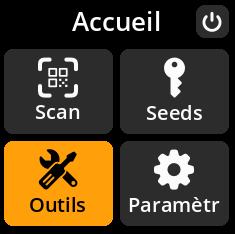
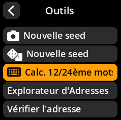
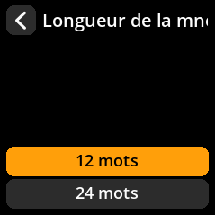
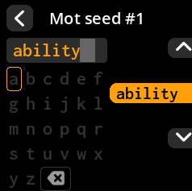
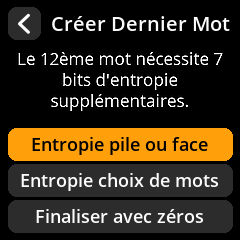
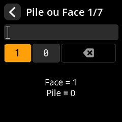
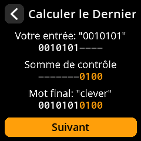
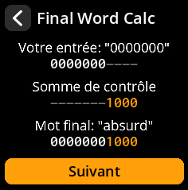
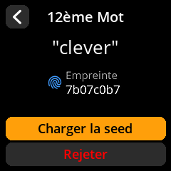

# Calcul de la génération d'une phrase de départ de 12ème/24ème mots

Cette méthode de création de phrase de départ vous permet de générer une phrase de départ cryptographiquement sécurisée en saisissant manuellement 11 mots (pour une phrase de départ de 12 mots) ou 23 mots (pour une phrase de départ de 24 mots), puis en calculant le mot final avec une validation de somme de contrôle appropriée. Le mot final (12ème ou 24ème) intègre une entropie supplémentaire et garantit la conformité de la phrase de départ aux normes BIP39.

## Processus complet avec toutes les captures d'écran

1. **Naviguer** : Menu principal → **Outils** → **Calc. 12ème/24ème mots**

     

     

2. **Choisir la longueur** : Sélectionnez **12 mots** ou **24 mots**

     

3. **Saisir des mots existants** : Utilisez le clavier à l’écran avec suggestions de mots intelligentes :
     - **Touche A** : Monter dans la liste des suggestions
     - **Touche C** : Descendre dans la liste des suggestions
     - **Touche B** : Sélectionner le mot suggéré en surbrillance

     

     

## Méthodes d’entropie pour le calcul du mot final

Le système fournit trois sources d’entropie différentes pour calculer le mot final, garantissant ainsi la sécurité cryptographique :

     

**🪙 Méthode d'entropie pile ou face**

- Lancez une pièce de monnaie exactement 7 fois.
- Pour chaque tirage, sélectionnez **1 pour face** ou **0 pour pile** en appuyant sur le **joystick**.
- Cette méthode fournit 7 bits d'entropie pour le calcul du mot final.

     

- Le système affiche votre chaîne binaire et calcule la somme de contrôle.

     

**📝 Méthode d'entropie choix de mots**

- Choisissez un mot de la liste BIP39 comme source d'entropie.
- Le mot sélectionné fournit les bits d'entropie nécessaires au calcul du mot final.

     

     

**🔢 Méthode de finalisation avec zéros**

- Utilise une simple chaîne de zéros de 7 bits, plus la somme de contrôle calculée sur 4 bits.
- C'est la méthode la plus simple, mais elle reste valable. Produit un mot final valide

     

## Affichage et complétion du mot final

**Créer Dernier Mot**

- Affiche le mot final calculé avec tous les détails de la dérivation
- Affiche la source d'entropie utilisée et le calcul de la somme de contrôle

     

**Écran de complétion**

- Examinez la phrase de départ complète avec le mot final calculé
- Votre phrase de départ est maintenant prête à être sauvegardée et utilisée.

     

> **📚 Note technique** : Le dernier mot de toute phrase source BIP39 contient à la fois des bits d'entropie et des bits de somme de contrôle. La somme de contrôle garantit la validité mathématique de la phrase source et permet de détecter les erreurs de transcription.
