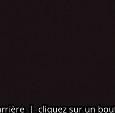
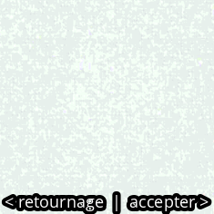
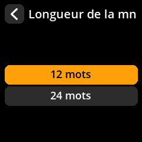

# Génération de graines par caméra

Créez des graines véritablement aléatoires grâce à l'entropie environnementale capturée par la caméra. Cette méthode offre un excellent caractère aléatoire en capturant des données visuelles imprévisibles.

## Procédure complète étape par étape avec toutes les captures d'écran

1. **Naviguer** : Menu principal → **Outils**

     

2. **Sélectionner la méthode** : Choisissez **« Nouvelle seed »** avec l'icône de l'appareil photo.

     

3. **Capturer l'entropie** :
     - Pointez l'appareil photo vers une scène changeante aléatoire (arbres, nuages en mouvement, etc.).
     - Appuyez sur n'importe quelle touche pour capturer l'entropie.

     

4. **Examiner la capture** :
     - Déplacez le joystick **vers la gauche** pour reprendre la photo
     - Déplacez le joystick **vers la droite** pour poursuivre la capture en cours

     

5. **Choisir la longueur** : Sélectionnez **12 mots** ou **24 mots** (24 mots recommandés pour une sécurité maximale)

     

6. **Accepter l'avertissement de sécurité** : Cliquez sur **« J'ai compris »** après avoir lu l'avertissement concernant les informations classifiées.

     

7. **Enregistrez vos mots clés** :
     - Les mots sont affichés par 4.
     - **Écrivez chaque mot soigneusement** dans l'ordre exact indiqué.
     - Vérifiez chaque mot au fur et à mesure que vous l'écrivez.

     

8. **Vérifiez votre sauvegarde** : Effectuez la vérification pour confirmer que vous avez tout enregistré correctement.

     

> **⚠️ Avertissement de sécurité critique** : Si vous notez Même un seul mot incorrect peut vous faire perdre définitivement l'accès à vos bitcoins. L'étape de vérification est obligatoire ; ne la négligez jamais !
