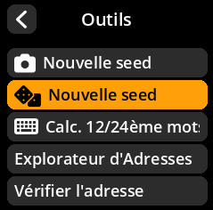
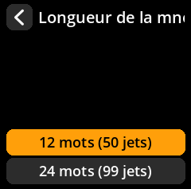
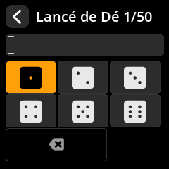
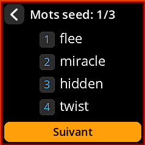
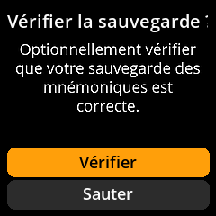

# Génération de graines par dés

Générez des graines à l'aide de dés physiques pour une sécurité maximale et un caractère aléatoire démontrable. Cette méthode est privilégiée par les utilisateurs soucieux de leur sécurité et souhaitant un contrôle total sur la source du caractère aléatoire.

## Procédure complète étape par étape avec toutes les captures d'écran

1. **Naviguer** : Menu principal → **Outils**

     

2. **Sélectionner la méthode** : Choisissez **« Nouvelle seed »** avec l'icône de dé

     

3. **Choisir la longueur** :
     - **12 mots** nécessite 50 lancers de dés
     - **24 mots** nécessite 99 lancers de dés (recommandé)

     

4. **Préparer les dés physiques** : Utilisez un dé standard à 6 faces.

5. **Lancer et participer** :
     - Lancer votre dé physique.
     - Sélectionner le chiffre correspondant (1 à 6) à l'écran en appuyant sur le **joystick**.
     - Répéter l'opération pour tous les lancers requis.

     

6. **Terminer tous les lancers** : L'indicateur de progression indique votre statut d'achèvement.

     

7. **Accepter l'avertissement de sécurité** : Cliquez sur **« J'ai compris »** après avoir lu l'avertissement concernant les informations classifiées.

     

8. **Enregistrer les mots clés générés** : Notez tous les mots clés dans l'ordre.

     

9. **Vérifier votre sauvegarde** : Terminer le processus de vérification.

     

> **🎲 Pourquoi utiliser des dés ?** Les dés physiques offrent un véritable caractère aléatoire, invulnérable aux vulnérabilités logicielles, aux portes dérobées matérielles ou aux interférences électromagnétiques. Cette méthode vous offre un contrôle total sur la source d'entropie.
