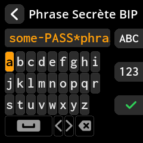
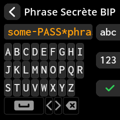
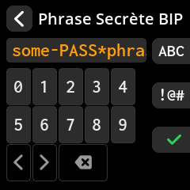
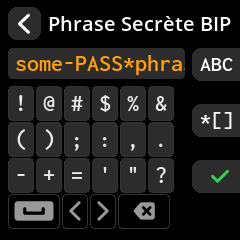
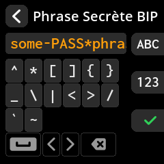
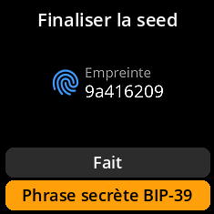

# Ajout d'une phrase secrète BIP-39

Renforcez la sécurité de votre seed avec une phrase secrète optionnelle. Cela crée un portefeuille entièrement différent, même avec les mêmes mots clés.

## Procédure complète étape par étape avec toutes les captures d'écran

1. **Accès à la saisie du mot de passe** : Dans l'écran « Finaliser le seed », sélectionnez **« Phrase secrète BIP-39 »**

     

2. **Saisissez votre mot de passe** : Utilisez le clavier virtuel avec plusieurs jeux de caractères :
     - **Mode par défaut** : Minuscules (a-z)

     

- **Touche A** : Passer aux majuscules Lettres (A-Z)

     

- **Touche B** : Accès aux chiffres (0-9) et aux symboles

     

     

     

3. **Vérifiez votre saisie** : Vérifiez l'exactitude de votre phrase secrète.

4. **Confirmez ou modifiez** : Sélectionnez **« Fait »** pour confirmer ou apportez des corrections si nécessaire.

     

> **🔐 Remarque de sécurité critique** : Une phrase secrète BIP-39 crée un portefeuille entièrement différent à partir des mêmes mots clés. Vous devez stocker votre phrase secrète séparément de vos mots clés. Perdre cette phrase secrète signifie perdre définitivement l'accès à ce portefeuille.
