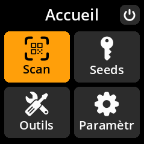
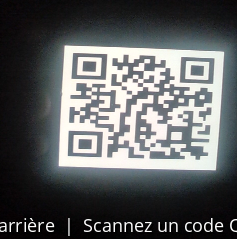
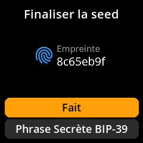
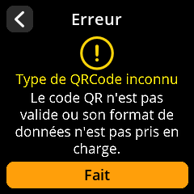

# Scanner SeedQR

Chargez rapidement et en toute sécurité des phrases clés à partir de codes SeedQR : un format de code QR compact spécialement conçu pour les phrases clés.

## Procédure complète étape par étape avec captures d'écran

1. **Naviguer** : Menu principal → **Scan**

     

2. **Positionner le code QR** : Pointez l'appareil photo vers votre code SeedQR

     

3. **Attendre la reconnaissance** : L'appareil détectera et traitera automatiquement les codes SeedQR valides.

4. **Vérifier les détails** : Vérifiez les informations sur le Seed sur l'écran « Finaliser le Seed ».

     

5. **Gestion des erreurs** : Si le message « Type de QRCode inconnu » s'affiche, le format du code QR n'est pas reconnu.

     

6. **Chargement complet** : Sélectionnez **« Fait »** pour charger le SeedQR.

> **❌ Dépannage** : Si le message « Type de QRCode inconnu » s'affiche, le format du code QR n'est pas reconnu comme un SeedQR valide. Appuyez sur « Fait » pour revenir au mode de numérisation et vérifier que vous utilisez un SeedQR correctement formaté.
