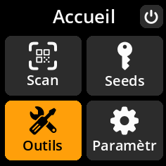
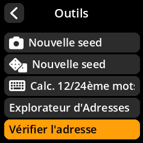
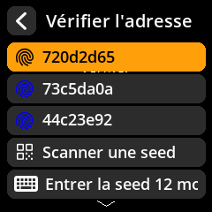
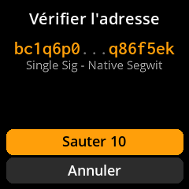
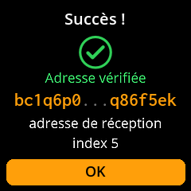

# 🛡️ Vérification et sécurité

## Vérifier la propriété de l'adresse

Confirmez qu'une adresse Bitcoin spécifique a bien été générée par votre seed chargée. Ceci est essentiel pour vérifier la légitimité des adresses partagées avec vous.

### Procédure complète étape par étape avec toutes les captures d'écran

1. **Naviguer** : Depuis l'écran d'accueil → **Outils** → **Vérifier l'adresse**

     

     

     

2. **Saisir l'adresse** : Sélectionnez l'adresse seed à vérifier en choisissant une Graine enregistrée, numérisation d'une nouvelle graine ou saisie manuelle d'une phrase de 12 à 24 mots.

     

3. **Résultats de l'examen** :
     - 🔍 **Recherche d'adresse** - Dérivation de l'adresse à partir de la graine chargée — peut prendre du temps. 
     - ✅ **Adresse trouvée** - L'adresse appartient à votre seed chargée

     

     

> **🚨 Cas d'utilisation de sécurité** : Utilisez cette fonctionnalité pour vérifier que les adresses fournies par les plateformes d'échange, les commerçants ou d'autres parties ont bien été générées par votre seed avant l'envoi de fonds. N'envoyez jamais de Bitcoins à des adresses non vérifiées.
