# Créer une sauvegarde SeedQR

Générez des sauvegardes compactes de votre phrase de départ par code QR pour un stockage et une récupération faciles.

## Procédure complète étape par étape avec toutes les captures d'écran

1. **Naviguer** : `Accueil → Seeds → [Sélectionner une graine] → Sauvegarde de la Seed → Exporter en tant que SeedQR`

    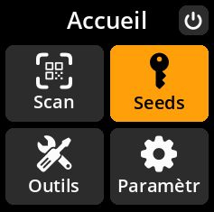

    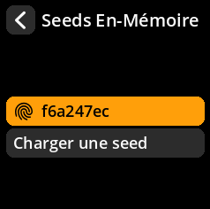

    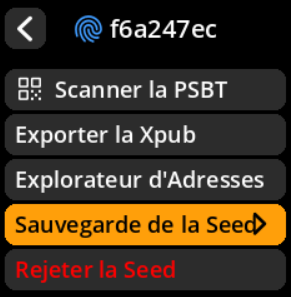

    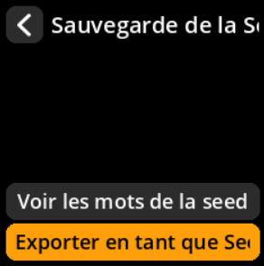

2. **Choisir le format** :
   - **« Standard : 25 x 25 »** - Plus grand, plus facile à numériser
   - **« Compact : 21 x 21 »** - Plus petit, nécessite une numérisation plus précise

    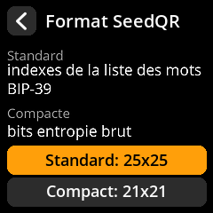

3. **Accepter l'avertissement** : Confirmer que vous comprenez que SeedQR contient votre clé privée complète

    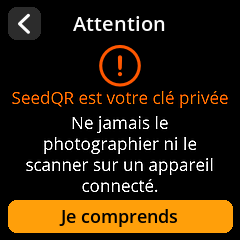

4. **Examen du QR complet** : Affichez le code QR complet, puis sélectionnez **« Je comprends »** pour examiner les sections agrandies.

    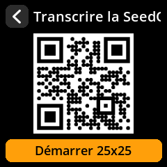

5. **Naviguer dans toutes les sections** : Utilisez le joystick pour examiner chaque partie du code QR et en vérifier l'exactitude.

    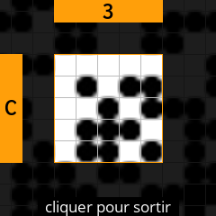

6. **Examen complet** : Appuyez sur n'importe quelle touche pour continuer. Deux options s'affichent :
   - **« Confirmer la SeedQR »** - Vérifier que le code QR généré est correct
   - **« Fait »** - Retour à l'écran principal de Seeds

    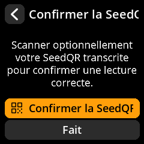

**Si vous sélectionnez « Confirmer SeedQR » :**

- L'appareil photo de l'appareil s'ouvre pour scanner le code QR transcrit
- Afficher l'image QR transcrite à l'appareil photo pour vérification
- Le système confirme que l'image capturée est correcte

    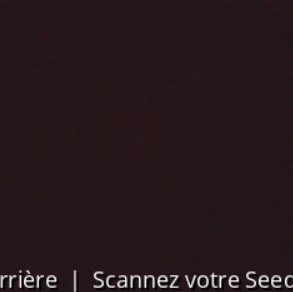

**Message de réussite :**

    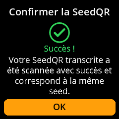

**Message d'échec :**

    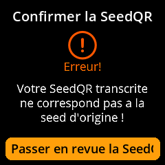

**Si vous sélectionnez « Terminé » :**

    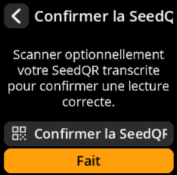

- Vous serez redirigé vers l'écran principal de Seeds.

    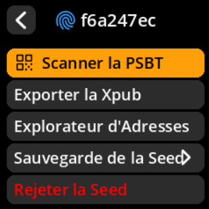

> **⚠️ Équivalent de sécurité** : Les codes SeedQR sont fonctionnellement équivalents à votre sauvegarde écrite. Conservez-les avec les mêmes mesures de sécurité : dans des coffres-forts ignifuges, des coffres-forts ou d'autres lieux sécurisés.
