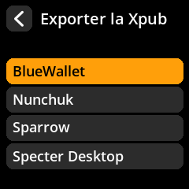
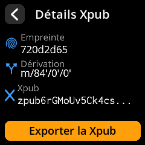

# Exporter la clé publique (Xpub)

Créez des portefeuilles en lecture seule dans votre logiciel Bitcoin préféré en exportant votre clé publique. Cela vous permet de surveiller vos soldes et de préparer vos transactions sans exposer vos clés privées.

## Procédure complète étape par étape avec toutes les captures d'écran

1. **Accéder à l'exportation** : Depuis l'écran principal du seed, sélectionnez **« Exporter la Xpub »**

     

2. **Choisir le type de signature** :
   - **« Single Sig »** - Pour les portefeuilles personnels standard
   - **« Multisig »** - Pour les portefeuilles multi-signatures nécessitant plusieurs appareils

     

3. **Sélectionner le type de script** :
   - **Segwit Natif** (bech32) - Recommandé pour les versions les plus récentes Frais
   - **Segwit Nested** (P2SH) - Pour la compatibilité avec les anciens systèmes
   - **Taproot** - Pour des fonctionnalités avancées de confidentialité et de contrats intelligents

     

4. **Choisir le logiciel de portefeuille** : Sélectionnez votre portefeuille préféré parmi les options prises en charge.

     

5. **Accepter l'avertissement de confidentialité** : Cliquez sur **« Je comprends »** après avoir lu les implications de confidentialité de Xpub.

     

6. **Générer un code QR** : Sélectionnez **« Exporter la Xpub »** pour afficher le code QR partageable.

     

7. **Importer dans le portefeuille** : Scannez le code QR avec le logiciel de portefeuille de votre choix.

     

> **🔒 Avertissement de confidentialité** : Votre xpub (clé publique étendue) révèle toutes vos adresses Bitcoin et l'historique de vos transactions. Ne la partagez qu'avec un logiciel de portefeuille de confiance et ne la publiez jamais en ligne.
