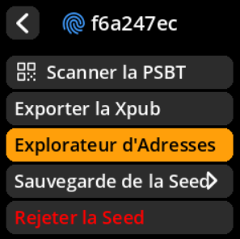
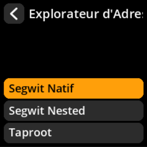
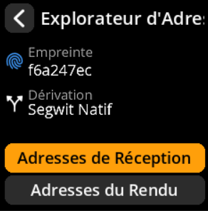
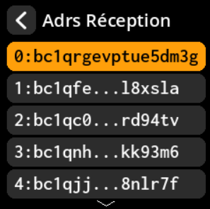

# Générer des adresses de réception

Affichez et partagez vos adresses de réception Bitcoin pour accepter les paiements.

## Procédure complète étape par étape avec toutes les captures d'écran

**Chemin de navigation** : `Accueil → Seeds → [Sélectionner Seed] → Explorateur d'adresses`

     

     

     

**Flux de processus** :

1. **Sélection du type de script** → Choisissez votre format d'adresse préféré

     

2. **Génération d'adresses** → Sélectionner **« Adresses de Réception »**

     

3. **Liste d'adresses** → Parcourir les adresses disponibles (paginées : 10 par vue)

     

4. **Génération de code QR** → Appuyez sur n'importe quelle adresse pour obtenir un code QR partageable.

     

> **💡 Bonne pratique** : Générez une nouvelle adresse de réception pour chaque transaction afin de préserver la confidentialité. Les adresses Bitcoin peuvent être réutilisées, mais cela n'est pas recommandé pour des raisons de confidentialité.
