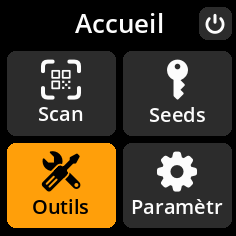
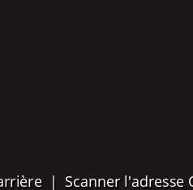
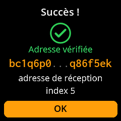

# 🛡️ Vérification et sécurité

## Vérifier la propriété de l'adresse

Confirmez qu'une adresse de réception Bitcoin spécifique a bien été générée par la graine chargée sur votre appareil SeedSigner. Cette vérification permet de garantir que les adresses générées par votre portefeuille logiciel (par exemple, Sparrow Wallet) correspondent à celles dérivées de votre graine isolée sur SeedSigner, vous protégeant ainsi contre les erreurs de configuration, les logiciels malveillants ou les falsifications.

**Important :** Cette fonctionnalité vérifie uniquement les adresses Bitcoin dérivées de votre propre graine. Elle **ne peut pas** être utilisée pour vérifier les adresses appartenant à des plateformes d'échange, des commerçants ou d'autres tiers.

### Emplacement recommandé

Cette section est idéalement située immédiatement après l'étape « Exporter la clé publique », car la vérification des adresses de réception générées est l'étape suivante naturelle pour confirmer le fonctionnement sécurisé du portefeuille logiciel lié.

### Instructions étape par étape

1. **Accéder à la vérification de l'adresse**

Depuis l'écran d'accueil de SeedSigner :
→ Sélectionnez **Outils**
→ Sélectionnez **Vérifier l'adresse**

     

     

     

2. **Saisir l'adresse à vérifier**
     - **Flux de travail principal :** Scanner une adresse de réception Bitcoin depuis votre logiciel Portefeuille (tel que Sparrow ou BlueWallet) que vous souhaitez vérifier.
     - **Facultatif (avancé)** : Vous pouvez également choisir de charger une graine enregistrée, de scanner une nouvelle graine ou de saisir manuellement votre phrase de 12/24 mots pour vérifier les adresses qu'elle contient. Cependant, ces méthodes sont moins courantes et destinées aux utilisateurs expérimentés.

     

3. **Processus de vérification**

- SeedSigner recherchera les adresses dérivées de votre graine chargée pour trouver une correspondance.
- Cette opération peut prendre un certain temps en fonction de la plage d'index d'adresses et de la complexité de la graine.

4. **Examiner les résultats**
     - 🔍 **Recherche d'adresse** : Dérivation d'une adresse à partir d'une graine chargée — peut prendre du temps.
     - ✅ **Adresse vérifiée** : L'adresse appartient à votre graine chargée.

     

     

---

### 🚨 Cas d'utilisation de sécurité

Utilisez cette fonctionnalité pour **confirmer qu'une adresse de réception générée par votre portefeuille logiciel correspond bien à celle générée à partir de votre seed hors ligne conservée dans SeedSigner**. Cette vérification vous protège contre :

- Les erreurs de configuration du portefeuille logiciel ;
- Les logiciels malveillants ou les manipulations susceptibles de remplacer votre adresse de réception par celle d'un attaquant ;
- Les erreurs commises avant d'envoyer ou de recevoir des Bitcoins.

**N'envoyez jamais de Bitcoins à une adresse non vérifiée.**

---

### Résumé et conseils

| Point clé | Explication |
| ------------------------------- | ---------------------------------------------------------------------------------------------------------------------------------- |
| Ce que SeedSigner vérifie | Si une adresse Bitcoin est dérivée de votre seed chargée, quel que soit l'endroit où elle a été créée. |
| Ce que SeedSigner ne vérifie PAS | La propriété ou l'authenticité des adresses provenant de plateformes d'échange, de commerçants ou de tiers. |
| Cas d'utilisation typique | Vérifier qu'une adresse de réception affichée dans votre portefeuille logiciel (par exemple, Sparrow) correspond à celle dérivée sur SeedSigner à l'aide de votre seed. |
| Pourquoi c'est important | Pour vous assurer de contrôler vos clés privées et de ne pas envoyer/recevoir de fonds à des adresses compromises ou incorrectes. |

---

### Remarques pour les nouveaux utilisateurs

- Cette fonctionnalité est conçue pour **faire correspondre** les adresses dérivées de votre seed, et non pour « vérifier » les adresses appartenant à d'autres.
- Le chargement ou la saisie d'une seed entière est possible, mais complexe et généralement inutile si votre seed est déjà chargée sur SeedSigner.
- Vérifiez toujours vos adresses avant de recevoir des fonds afin de garantir une sécurité totale.
