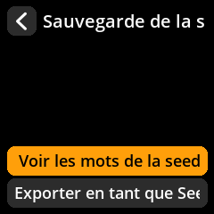
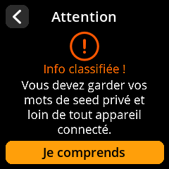
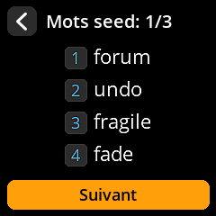
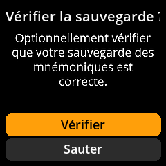

# Afficher les mots clés

Accédez à vos mots clés à des fins de vérification ou de récupération de sauvegarde.

## Procédure complète étape par étape avec toutes les captures d'écran

1. **Naviguer** : `Accueil → Seeds → [Sélectionner Seed] → Sauvegarde de la Seed → Voir les mots de la seed`

     

     

     

     

2. **Accepter l'avertissement de sécurité** : Cliquez sur **« Je comprends »** pour l'avertissement concernant les informations classifiées.

     

3. **Examiner tous les mots** : Affichez votre phrase clé complète (affichée 4 mots à la fois).

     

4. **Vérification facultative** : Terminez le processus de vérification de la sauvegarde en sélectionnant **« Vérifier »** ou **« Sauter »** pour continuer.

     

5. **Quitter en toute sécurité** : Assurez-vous d'être dans un endroit privé avant de visionner.

> **🔐 Avertissement de sécurité critique** : Visionnez les mots clés uniquement dans un endroit privé et sécurisé, loin des caméras, des autres personnes et de tout appareil d'enregistrement. Pensez à couvrir l'écran sous différents angles.
