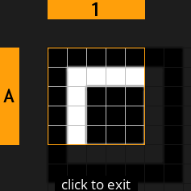
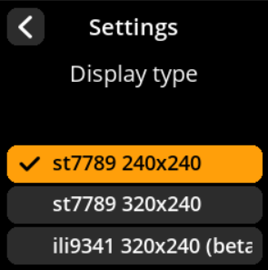
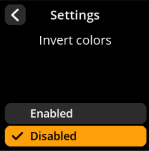

# SeedSigner User Guide

  

SeedSigner is an air-gapped, open-source Bitcoin signing device that helps you manage seed phrases and sign transactions securely. This guide provides step-by-step instructions organized by common workflows.

## 📋 Table of Contents

### 🚀 Getting Started

- [Initial Setup and Power On](#initial-setup-and-power-on)
- [Navigation Basics](#navigation-basics)
- [Powering Off Safely](#powering-off-safely)
- [Restarting Your Device](#restarting-your-device)

### 🌱 Seed Management

- **Creating New Seeds**
  - [Camera-Based Seed Generation](#camera-based-seed-generation)
  - [Dice-Based Seed Generation](#dice-based-seed-generation)
  - [Calc 12th/24th Word Seed Generation](#calc-12th24th-word-seed-generation)
- **Loading Existing Seeds**
  - [Manual Seed Entry](#manual-seed-entry)
  - [SeedQR Scanning](#seedqr-scanning)
  - [Adding BIP-39 Passphrase](#adding-bip-39-passphrase)

### 🔧 Working with Loaded Seeds

- [Export Public Key (Xpub)](#export-public-key-xpub)
- [Generate Receiving Addresses](#generate-receiving-addresses)
- [View Seed Words](#view-seed-words)
- [Create SeedQR Backup](#create-seedqr-backup)

### ✍️ Transactions & Verification

- [Sign Bitcoin Transaction (PSBT)](#sign-bitcoin-transaction-psbt)
- [Verify Address Ownership](#verify-address-ownership)
- [Discard Loaded Seed](#discard-loaded-seed)

### ⚙️ Device Configuration

- **Basic Settings**
  - [Language Configuration](#language-configuration)
  - [Persistent Settings](#persistent-settings)
  - [Coordinator Software Support](#coordinator-software-support)
  - [Denomination Display](#denomination-display)
  - [Hardware I/O Testing](#hardware-io-testing)
  - [Donation Information](#donation-information)

- **Advanced Settings**
  - [Bitcoin Network Selection](#bitcoin-network-selection)
  - [QR Code Density](#qr-code-density)
  - [Xpub Export Configuration](#xpub-export-configuration)
  - [Signature Types Configuration](#signature-types-configuration)
  - [Script Types Configuration](#script-types-configuration)
  - [Show Xpub Details](#show-xpub-details)
  - [BIP-39 Passphrase Configuration](#bip-39-passphrase-configuration)
  - [Camera Rotation](#camera-rotation)
  - [Compact SeedQR](#compact-seedqr)
  - [BIP-85 Child Seeds](#bip-85-child-seeds)
  - [Electrum Seeds](#electrum-seeds)
  - [Message Signing](#message-signing)
  - [Privacy Warnings](#privacy-warnings)
  - [Dire Warnings](#dire-warnings)
  - [QR Brightness Tips](#qr-brightness-tips)
  - [Partner Logos](#partner-logos)

- **Hardware Settings**
  - [Display Type Configuration](#display-type-configuration)
  - [Color Inversion](#color-inversion)

### 🔧 Support & Resources

- [Troubleshooting](#-troubleshooting)
- [Additional Resources](#-additional-resources)
- [Security Considerations](#-security-considerations)

> 💡 **Quick Navigation Tip**: Use Ctrl+F (or Cmd+F on Mac) to search for specific topics within this guide.

---

## Hardware Components

A SeedSigner device consists of:

1. **Raspberry Pi Zero** - The main computing unit
2. **Raspberry Pi Camera** - For QR code scanning and entropy capture
3. **WaveShare 1.3inch LCD Hat** - Display and control interface

### WaveShare LCD Hat Controls

  

The WaveShare LCD Hat provides the following controls:

- **Joystick**: Four-directional navigation (Up, Down, Left, Right) plus center press
- **Key1 (A)**: Primary action button
- **Key2 (B)**: Secondary action button  
- **Key3 (C)**: Tertiary action button

### Button Functions Reference

| Control        | Function                                    |
| -------------- | ------------------------------------------- |
| Joystick Up    | Move selection up                           |
| Joystick Down  | Move selection down                         |
| Joystick Left  | Move selection left                         |
| Joystick Right | Move selection right                        |
| Joystick Press | Alternative selection/confirm (context-dependent) |
| Key1 (A)       | Select highlighted option or confirm action |
| Key2 (B)       | Select highlighted option or confirm action |
| Key3 (C)       | Select highlighted option or confirm action |

**Important Navigation Notes**:

- All three keys (A, B, C) function identically for selection and confirmation
- To go back to a previous screen, navigate to the back arrow/button using the joystick first, then press any key to activate it
- The joystick center press may have different functions depending on the current screen context

---

## 🚀 Getting Started

### Initial Setup and Power On

#### Starting Your Device

1. **Connect Power**: Use a Micro USB cable to power your SeedSigner
2. **Wait for Boot**: Wait for few seconds for the complete boot sequence
3. **Dismiss Initial Notification**: Press any key (A, B, or C) to dismiss the "You can remove the SD card now" message

     

> **💡 Pro Tip**: Once the operating system loads into RAM, you can safely remove the SD card. This ensures that seed phrases cannot be accidentally stored on the device, maintaining air-gapped security.

### Navigation Basics

- Use the **joystick** to highlight menu options
- Press **any key (A, B, or C)** to select the highlighted option
- Look for **back arrows** or **"Back" buttons** to return to previous screens
- The **power icon** in the top-right corner provides power options

### Powering Off Safely

**Method 1: Proper Shutdown**

1. Navigate to the **power icon** (top right of main menu)

     

2. Press any key to open the power menu

     

3. Select **"Power Off"** and confirm your choice

     

**Method 2: Direct Unplugging**
You can safely unplug the device at any time. SeedSigner stores nothing permanently, so all sensitive data is automatically cleared when power is removed.

### Restarting Your Device

1. **Navigate to Power Menu**: Use the joystick to navigate to the **power icon** in the top-right corner of the home screen

     

2. **Open Power Options**: Press any key (A, B, or C) to access the power menu
3. **Select Restart**: Choose **"Restart"** from the available options

     

4. **Confirm Action**: The device will reboot and return to the main menu

     

> **🔄 Quick Reset**: Restarting clears all temporary data and returns the device to its initial state while preserving your configured settings (if persistent settings are enabled).

---

## 🌱 Creating New Seeds

### Camera-Based Seed Generation

Create truly random seeds using environmental entropy captured by the camera. This method provides excellent randomness by capturing unpredictable visual data.

#### Complete Step-by-Step Process with All Screenshots

1. **Navigate**: Main Menu → **Tools**

     

2. **Select Method**: Choose **"New Seed"** with the camera icon

     

3. **Capture Entropy**:
   - Point the camera at a random, changing scene (moving trees, clouds, etc.)
   - Press any key to capture the entropy

     

4. **Review Capture**:
   - Move joystick **left** to retake the photo
   - Move joystick **right** to continue with current capture

     

5. **Choose Length**: Select **12 words** or **24 words** (24 words recommended for maximum security)

     

6. **Acknowledge Security Warning**: Press **"I Understand"** after reading the classified information warning

     

7. **Record Your Seed Words**:
   - Words are displayed 4 at a time
   - **Write down every word carefully** in the exact order shown
   - Double-check each word as you write it

     

8. **Verify Your Backup**: Complete the verification process to confirm you've recorded everything correctly

     

> **⚠️ Critical Security Warning**: If you write down even one word incorrectly, you could lose access to your Bitcoin forever. The verification step is mandatory - never skip it!

### Dice-Based Seed Generation

Generate seeds using physical dice for maximum security and provable randomness. This method is preferred by security-conscious users who want complete control over the randomness source.

#### Complete Step-by-Step Process with All Screenshots

1. **Navigate**: Main Menu → **Tools**

     

2. **Select Method**: Choose **"New Seed"** with the dice icon

     

3. **Choose Length**:
   - **12 words** requires 50 dice rolls
   - **24 words** requires 99 dice rolls (recommended)

     

4. **Prepare Physical Dice**: Use a standard 6-sided die

5. **Roll and Enter**:
   - Roll your physical die
   - Select the corresponding number (1-6) on the screen by pressing the **Joystick**
   - Repeat for all required rolls

     

6. **Complete All Rolls**: The progress indicator shows your completion status

     

7. **Acknowledge Security Warning**: Press **"I Understand"** after reading the classified information warning

     

8. **Record Generated Words**: Write down all seed words in order

     

9. **Verify Your Backup**: Complete the verification process

     

> **🎲 Why Use Dice?** Physical dice provide true randomness that cannot be compromised by software vulnerabilities, hardware backdoors, or electromagnetic interference. This method gives you complete control over the entropy source.

### Calc 12th/24th Word Seed Generation

This seed creation method allows you to generate a cryptographically secure seed phrase by entering 11 words (for 12-word seed) or 23 words (for 24-word seed) manually, then calculating the final word with proper checksum validation. The final word (12th or 24th) incorporates additional entropy and ensures the seed phrase meets BIP39 standards.

#### Complete Process with All Screenshots

1. **Navigate**: Main Menu → **Tools** → **"Calc 12th/24th word"**

     

     

2. **Choose Length**: Select **12 words** or **24 words**

     

3. **Enter Existing Words**: Use the on-screen keyboard with intelligent word suggestions:
   - **Key A**: Move up in the suggestions list
   - **Key C**: Move down in the suggestions list  
   - **Key B**: Select the highlighted suggested word

     

     

#### Entropy Methods for Final Word Calculation

The system provides three different entropy sources to calculate the final word, ensuring cryptographic security:

     

**🪙 Coin Flip Entropy Method**

- Flip a physical coin exactly 7 times
- For each flip, select **1 for Heads** or **0 for Tails** by pressing the **Joystick**
- This method provides 7 bits of entropy for the final word calculation

     

- The system displays your binary string and calculates the checksum

     

**📝 Word Selection Entropy Method**

- Choose any word from the BIP39 wordlist as your entropy source
- The selected word provides the entropy bits needed for final word calculation

     

**🔢 Finalize with Zeros Method**

- Uses a simple 7-bit string of zeros plus the calculated 4-bit checksum
- This is the simplest method but still produces a valid final word

     

#### Final Word Display and Completion

**Final Word Display**

- Shows the calculated final word with full derivation details
- Displays the entropy source used and checksum calculation

     

**Completion Screen**

- Review the complete seed phrase with the calculated final word
- Your seed is now ready for backup and use

     

> **📚 Technical Note**: The final word in any BIP39 seed contains both entropy bits and checksum bits. The checksum ensures the seed phrase is mathematically valid and helps detect transcription errors.

---

## 📥 Loading Existing Seeds

### Manual Seed Entry

Enter your existing mnemonic phrase using the on-screen keyboard system.

#### Complete Step-by-Step Process with All Screenshots

1. **Navigate**: Main Menu → **Seeds** → **"Load a Seed"**

     

     

2. **Choose Length**: Select **"Enter 12-word seed"** or **"Enter 24-word seed"**

     

     

3. **Enter Each Word**:
   - Use the on-screen keyboard with intelligent word suggestions
   - Type the first few letters and select from suggestions for faster entry
   - **Key A**: Move up in the suggestions list
   - **Key C**: Move down in the suggestions list  
   - **Key B**: Select the highlighted suggested word

     

4. **Review Seed Fingerprint**: Check the unique identifier on the "Finalize Seed" screen

     

5. **Complete Loading**:
   - Select **"Done"** to load the seed as-is
   - Or select **"BIP-39 Passphrase"** to add an additional security layer

> **⚡ Speed Tip**: The word suggestion feature dramatically speeds up entry. Type just the first 2-3 letters of each word and select from the filtered suggestions rather than typing each letter individually.

### SeedQR Scanning

Quickly and securely load seeds from SeedQR codes - a compact QR code format specifically designed for seed phrases.

#### Complete Step-by-Step Process with All Screenshots

1. **Navigate**: Main Menu → **Scan**

     

2. **Position QR Code**: Point the camera at your SeedQR code

     

3. **Wait for Recognition**: The device will automatically detect and process valid SeedQR codes

4. **Review Details**: Check the seed information on the "Finalize Seed" screen

     

5. **Handle Errors**: If you see "Unknown QR Type", the QR code format isn't recognized

     

6. **Complete Loading**: Select **"Done"** to load the seed

> **❌ Troubleshooting**: If you see "Unknown QR Type", the QR code format isn't recognized as a valid SeedQR. Press "Done" to return to scanning mode and verify you're using a properly formatted SeedQR code.

### Adding BIP-39 Passphrase

Enhance your seed security with an optional passphrase. This creates an entirely different wallet even with the same seed words.

#### Complete Step-by-Step Process with All Screenshots

1. **Access Passphrase Entry**: From the "Finalize Seed" screen, select **"BIP-39 Passphrase"**

     

2. **Enter Your Passphrase**: Use the on-screen keyboard with multiple character sets:
   - **Default Mode**: Lowercase letters (a-z)

     

- **Key A**: Switch to uppercase letters (A-Z)

     

- **Key B**: Access numbers (0-9) and symbols

     

     

     

3. **Review Your Entry**: Double-check your passphrase for accuracy

4. **Confirm or Edit**: Select **"Done"** to confirm, or make corrections if needed

     

> **🔐 Critical Security Note**: A BIP-39 passphrase creates an entirely different wallet from the same seed words. You must store your passphrase separately from your seed words. Losing the passphrase means losing access to that wallet forever.

---

## 🔧 Working with Loaded Seeds

### Export Public Key (Xpub)

Create watch-only wallets in your favorite Bitcoin software by exporting your public key. This allows you to monitor balances and prepare transactions without exposing your private keys.

#### Complete Step-by-Step Process with All Screenshots

1. **Access Export**: From the seed's main screen, select **"Export Xpub"**

     

2. **Choose Signature Type**:
   - **"Single Sig"** - For standard personal wallets
   - **"Multisig"** - For multi-signature wallets requiring multiple devices

     

3. **Select Script Type**:
   - **Native Segwit** (bech32) - Recommended for lowest fees
   - **Nested Segwit** (P2SH) - For compatibility with older systems
   - **Taproot** - For advanced privacy and smart contract features

     

4. **Choose Wallet Software**: Select your preferred wallet from supported options

     

5. **Acknowledge Privacy Warning**: Press **"I Understand"** after reading the xpub privacy implications

     

6. **Generate QR Code**: Select **"Export XPub"** to display the shareable QR code

     

7. **Import to Wallet**: Scan the QR code with your chosen wallet software

     

> **🔒 Privacy Warning**: Your xpub (extended public key) reveals all your Bitcoin addresses and transaction history. Only share it with wallet software you trust, and never post it publicly online.

### Generate Receiving Addresses

View and share your Bitcoin receiving addresses for accepting payments.

#### Complete Step-by-Step Process with All Screenshots

**Navigation Path**: `Home → Seeds → [Select Seed] → Address Explorer`

     

     

     

**Process Flow**:

1. **Script Type Selection** → Choose your preferred address format

     

2. **Address Generation** → Select "Receive addresses"

     

3. **Address List** → Browse available addresses (paginated: 10 per view)

     

4. **QR Code Generation** → Tap any address for shareable QR code

     

> **💡 Best Practice**: Generate a new receiving address for each transaction to maintain privacy. Bitcoin addresses can be reused but it's not recommended for privacy reasons.

### Generate Change Addresses

View addresses used for transaction change return

#### Complete Step-by-Step Process with All Screenshots

**Navigation Path**: `Home → Seeds → [Select Seed] → Address Explorer`

     

     

     

**Process Flow**:

1. **Script Type Selection** → Choose your preferred address format

     

2. **Change Access** → Select "Change Address" instead of receive

     

3. **Address Management** → Browse change addresses (paginated: 10 per view)

     

4. **QR Code Access** → Tap any address for QR code display

     

#### Key Information

**Address Types Available**:

- Native Segwit (recommended)
- Nested Segwit (compatibility)  
- Taproot (advanced features)

**Privacy Best Practice**: Use a fresh receiving address for each transaction

**Technical Note**: Change addresses automatically handle transaction remainder funds

>**💡 Best Practice**: Change addresses are automatically managed by your wallet - you typically don't need to manually generate or share them.

### View Seed Words

Access your seed words for backup verification or recovery purposes.

#### Complete Step-by-Step Process with All Screenshots

1. **Navigate**: `Home → Seeds → [Select Seed] → Backup Seed → View Seed Words`

     

     

     

     

2. **Acknowledge Security Warning**: Press **"I Understand"** for the classified information warning

     

3. **Review All Words**: View your complete seed phrase (displayed 4 words at a time)

     

4. **Optional Verification**: Complete backup verification process by selecting verify or else select skip to proceed

     

5. **Exit Securely**: Ensure you're in a private location before viewing

> **🔐 Critical Security Warning**: Only view seed words in a completely private, secure location away from cameras, other people, and any recording devices. Consider covering the screen from different angles.

### Create SeedQR Backup

Generate compact QR code backups of your seed phrase for convenient storage and recovery.

#### Complete Step-by-Step Process with All Screenshots

1. **Navigate**: `Home → Seeds → [Select Seed] → Backup Seed → View Seed Words`

     

     

     

     

2. **Choose Format**:
   - **"Standard: 25x25"** - Larger, easier to scan
   - **"Compact: 21x21"** - Smaller, requires more precise scanning

     

3. **Acknowledge Warning**: Confirm that you understand SeedQR contains your complete private key

     

4. **Review Complete QR**: View the full QR code, then select **"Begin"** to examine zoomed sections

     

5. **Navigate All Sections**: Use the joystick to review every part of the QR code for accuracy

     

6. **Complete Review**: Press any key to proceed. You'll see two options:
   - **"Confirm SeedQR"** - Verify the generated QR code is correct
   - **"Done"** - Return to Seeds main screen

     

   **If you select "Confirm SeedQR":**

- The device camera will open to scan the transcribed QR code
- Show the transcribed QR image to the camera for verification
- The system will confirm whether the correct image was captured

     

   **Success Message:**

     

   **Failure Message:**

     

   **If you select "Done":**

- You'll be redirected back to the Seeds main screen

     

> **⚠️ Security Equivalent**: SeedQR codes are functionally equivalent to your written seed backup. Store them with the same security measures - in fireproof safes, safety deposit boxes, or other secure locations.

---

## ✍️ Sign Bitcoin Transaction (PSBT)

Securely approve and sign Bitcoin transactions created by your wallet software. PSBT (Partially Signed Bitcoin Transaction) is the standard format for unsigned transactions.

### Complete Step-by-Step Process with All Screenshots

1. **Access Signing**: From your seed's main screen, select **"Scan PSBT"**

     

2. **Scan Transaction QR**: Point the camera at the transaction QR code generated by your wallet software

     

3. **Review Transaction Details**: Carefully verify ALL information displayed

     

   **Critical Items to Verify:**

- ✅ **Recipient address** - Confirm this matches your intended destination
- ✅ **Amount being sent** - Verify the exact Bitcoin amount
- ✅ **Transaction fee** - Check that the fee is reasonable
- ✅ **Change address** - Ensure change returns to your wallet

4. **Select Signing Seed**: Choose the appropriate seed if multiple are loaded

     

5. **Authorize Signing**: Confirm you want to sign this transaction

     

6. **Broadcast Transaction**: Scan the resulting signed QR code back into your wallet software
7. **Confirm Broadcast**: Your wallet will broadcast the transaction to the Bitcoin network

> **🚨 Critical Security Check**: Bitcoin transactions are irreversible once broadcast to the network. ALWAYS verify the recipient address and amount before signing. Double-check that the recipient address matches your intended destination exactly.

---

## 🛡️ Verification and Security

### Verify Address Ownership

Confirm that a specific Bitcoin address was actually generated by your loaded seed. This is crucial for verifying that addresses shared with you are legitimate.

#### Complete Step-by-Step Process with All Screenshots

1. **Navigate**: From Home screen → **"Tools"** → **"Verify Address"**

     

     

     

2. **Enter Address**: Select the seed address you want to verify by choosing a saved seed, scanning a new seed, or manually entering a 12/24-word seed phrase.

     

3. **Review Results**:
   - 🔍 **Address Searching** - Deriving address from loaded seed — may take time.
   - ✅ **Address Found** - The address belongs to your loaded seed

     

     

> **🚨 Security Use Case**: Use this feature to verify that addresses provided by exchanges, merchants, or other parties were actually generated by your seed before sending funds. Never send Bitcoin to unverified addresses.

### Discard Loaded Seed

Safely remove the current seed from memory when you're finished with your operations.

#### Complete Step-by-Step Process with All Screenshots

1. **Navigate**: `Home → Seeds → [Select Seed] → Backup Seed → View Seed Words`

     

     

     

2. **Confirm Discard**: Select **"Discard"** to remove the seed from memory

     

3. **Return to Main Menu**: You'll be returned to the main menu with no seed loaded

     

> **🧹 Memory Clearing**: Discarding a seed completely removes it from device memory. This is a security best practice when switching between different seeds or when finished with operations.

---

## ⚙️ Device Settings

### Language Configuration

Set your preferred language for the SeedSigner interface.

#### Step-by-Step Process

1. **Navigate**: Main Menu → **Settings** → **Language**
2. **Select Language**: Choose your preferred language from the available options
3. **Confirm Selection**: The interface will update to use your chosen language

     

     

     

### Persistent Settings

Configure whether your settings are saved permanently or reset on each boot.

#### Step-by-Step Process

1. **Navigate**: Main Menu → **Settings** → **Persistent Settings**  
2. **Choose Mode**:
   - **"Enabled"** - Saves settings to SD card (survives reboots)
   - **"Disabled"** - Temporary settings only (resets on power cycle)

     

     

     

> **🔒 Security Consideration**: Enabled persistent settings provide convenience but store configuration data on the SD card. Disabled persistent settings provide maximum security but require reconfiguring preferences after each boot.

### Coordinator Software Support

Enable or disable support for specific wallet applications. This customizes QR code formats and compatibility.

#### Step-by-Step Process

1. **Navigate**: Main Menu → **Settings** → **Coordinator Software**
2. **Configure Support** for each wallet:
   - ✅ **BlueWallet** - Mobile Bitcoin wallet
   - ✅ **Nunchuk** - Collaborative custody wallet  
   - ✅ **Sparrow Wallet** - Desktop Bitcoin wallet
   - ✅ **Specter Desktop** - Privacy-focused wallet
   - ✅ **Keeper** - Inheritance planning wallet

     

     

     

### Denomination Display

Configure how Bitcoin amounts are displayed on the device.

#### Step-by-Step Process

1. **Navigate**: Main Menu → **Settings** → **Denomination Display**
2. **Select Display Format**: Choose your preferred denomination format from available options
3. **Default Setting**: Threshold at 0.01 is selected by default

     

     

     

### Hardware I/O Testing

Verify that all device components are functioning correctly.

#### Step-by-Step Process

1. **Navigate**: Main Menu → **Settings** → **I/O Test**
2. **Test Controllers**: Use this screen to test your device's input/output functionality
3. **Verify Components**: Ensure all buttons, display, and camera are working properly

     

     

     

### Donation Information

Access donation details to support SeedSigner development.

#### Step-by-Step Process

1. **Navigate**: Main Menu → **Settings** → **Donate**
2. **View Details**: Review donation information and addresses
3. **Support Development**: Consider contributing to the project

     

     

     

## 🔧 Advanced Settings

### Bitcoin Network Selection

Choose which Bitcoin network to use for addresses and transactions.

1. **Navigate**: Settings → **Advanced** → **Bitcoin Network**
2. **Select Network**:
   - **Mainnet** - Real Bitcoin network (default for normal use)
   - **Testnet** - Test network for development and experimentation
   - **Regtest** - Local regression testing network

     

     

     

     

> **⚠️ Network Warning**: Always ensure you're using Mainnet for real Bitcoin transactions. Testnet and Regtest are for development purposes only.

### QR Code Density

Adjust the density of generated QR codes to balance size and scannability.

1. **Navigate**: Settings → **Advanced** → **QR Code Density**
2. **Choose Density**:
   - **Low** - Larger, easier to scan QR codes
   - **Medium** - Balanced size and compatibility (default)
   - **High** - Smaller, more data-dense QR codes

     

     

     

     

### Xpub Export Configuration

Control extended public key export functionality.

#### Step-by-Step Process

1. **Navigate**: Settings → **Advanced** → **Xpub Export**
2. **Choose Mode**:
   - **Enabled** - Allow xpub export (default)
   - **Disabled** - Disable xpub export functionality

     

     

     

     

### Signature Types Configuration

Configure which signature types are supported by the device.

#### Step-by-Step Process

1. **Navigate**: Settings → **Advanced** → **Sig Types**
2. **Select Supported Types**:
   - **Single Sig** - Single signature transactions
   - **Multisig** - Multi-signature transactions
3. **Default Setting**: Both Single Sig and Multisig are selected by default

     

     

     

     

### Script Types Configuration

Define which Bitcoin script types are supported on the device.

#### Step-by-Step Process

1. **Navigate**: Settings → **Advanced** → **Script Types**
2. **Select Supported Scripts**:
   - **Native Segwit** - P2WPKH addresses (default enabled)
   - **Nested Segwit** - P2SH-wrapped Segwit (default enabled)
   - **Legacy** - P2PKH addresses
   - **Taproot** - P2TR addresses (default enabled)
   - **Custom Derivation** - Custom derivation paths

     

     

     

     

### Show Xpub Details

Control whether extended public key details are displayed.

#### Step-by-Step Process

1. **Navigate**: Settings → **Advanced** → **Show Xpub Details**
2. **Choose Display Mode**:
   - **Enabled** - Show detailed xpub information (default)
   - **Disabled** - Hide xpub details

   

     

     

     

     

### BIP-39 Passphrase Configuration

Control how the device handles BIP-39 passphrases.

1. **Navigate**: Settings → **Advanced** → **BIP-39 Passphrase**
2. **Choose Mode**:
   - **Enabled** - Passphrase is optional (default recommended setting)
   - **Disabled** - No passphrase support at all
   - **Required** - Every seed must have a passphrase

     

     

     

     

### Camera Rotation

Adjust camera orientation to match your device setup.

1. **Navigate**: Settings → **Advanced** → **Camera Rotation**
2. **Select Rotation**:
   - **0 degrees** - No rotation
   - **90 degrees** - Quarter turn clockwise
   - **180 degrees** - Upside down (default for most setups)
   - **270 degrees** - Quarter turn counter-clockwise

     

     

     

     

### Compact SeedQR

Configure SeedQR compression settings for more efficient QR codes.

#### Step-by-Step Process

1. **Navigate**: Settings → **Advanced** → **Compact SeedQR**
2. **Choose Mode**:
   - **Enabled** - Use compact SeedQR format (default)
   - **Disabled** - Use standard SeedQR format

     

     

     

     

### BIP-85 Child Seeds

Enable support for BIP-85 deterministic child seed generation.

#### Step-by-Step Process

1. **Navigate**: Settings → **Advanced** → **BIP-85 Child Seeds**
2. **Choose Mode**:
   - **Enabled** - Support BIP-85 child seed generation
   - **Disabled** - Disable BIP-85 functionality (default)

     

     

     

     

### Electrum Seeds

Configure support for Electrum-style seed phrases.

#### Step-by-Step Process

1. **Navigate**: Settings → **Advanced** → **Electrum Seeds**
2. **Choose Mode**:
   - **Enabled** - Support Electrum seed format
   - **Disabled** - Standard BIP-39 only (default)

     

     

     

     

### Message Signing

Enable cryptographic message signing functionality.

#### Step-by-Step Process

1. **Navigate**: Settings → **Advanced** → **Message Signing**
2. **Choose Mode**:
   - **Enabled** - Allow message signing
   - **Disabled** - Disable message signing (default)

     

     

     

     

### Privacy Warnings

Control display of privacy-related warnings and notifications.

#### Step-by-Step Process

1. **Navigate**: Settings → **Advanced** → **Show Privacy Warnings**
2. **Choose Display Mode**:
   - **Enabled** - Show privacy warnings (default)
   - **Disabled** - Hide privacy warnings

     

     

     

     

### Dire Warnings

Configure display of critical security warnings.

#### Step-by-Step Process

1. **Navigate**: Settings → **Advanced** → **Show Dire Warnings**
2. **Choose Display Mode**:
   - **Enabled** - Show critical warnings (default)
   - **Disabled** - Hide dire warnings

     

     

     

     

### QR Brightness Tips

Manage QR code brightness tips directly from your settings menu.

#### Step-by-Step Process

1. **Navigate**: Settings → **Advanced** → **Show QR Brightness Tips**
2. **Choose Display Mode**:
   - **Enabled** - Show brightness tips (default)
   - **Disabled** - Hide brightness tips

     

     

     

     

### Partner Logos

Control display of partner and wallet provider logos.

#### Step-by-Step Process

1. **Navigate**: Settings → **Advanced** → **Show Partner Logos**
2. **Choose Display Mode**:
   - **Enabled** - Show partner logos (default)
   - **Disabled** - Hide partner logos

     

     

     

     

## 🖥️ Hardware Settings

### Display Type Configuration

Configure the display driver for your specific hardware setup.

#### Step-by-Step Process

1. **Navigate**: Settings → **Advanced** → **Hardware** → **Display Type**
2. **Select Display Driver**:
   - **st7789 240x240** - Standard square display (default)
   - **st7789 320x240** - Rectangular display option
   - **ili9341 320x240 (beta)** - Alternative display driver (beta)

     

     

     

     

     

### Color Inversion

Invert display colors for different viewing preferences or hardware configurations.

#### Step-by-Step Process

1. **Navigate**: Settings → **Advanced** → **Hardware** → **Invert Colors**
2. **Choose Color Mode**:
   - **Enabled** - Invert display colors (default)
   - **Disabled** - Standard color display

     

     

     

     

     

> **🔧 Troubleshooting Use**: Run hardware tests if you're experiencing issues with button responses, display problems, or camera malfunctions. This helps isolate hardware vs. software issues.

---

## 🆘 Troubleshooting

### Common Issues and Solutions

#### Device Won't Boot

**Symptoms**: Black screen, no response when powered on
**Solutions**:

- ✅ Verify power source provides sufficient current (2A recommended)
- ✅ Check all hardware connections are secure
- ✅ Try a different SD card with fresh SeedSigner image
- ✅ Test with a different power cable

#### QR Code Scanning Problems

**Symptoms**: QR codes not recognized, scanning timeouts
**Solutions**:

- ✅ Ensure adequate lighting on the QR code
- ✅ Hold the device steady at proper distance (6-12 inches)
- ✅ Clean the camera lens with a soft cloth
- ✅ Try adjusting QR code density in settings
- ✅ Check camera rotation settings
- ✅ Test camera functionality in Hardware I/O Test

#### Incorrect Seed Generation

**Symptoms**: Generated seed doesn't match expected results
**Solutions**:

- ✅ Verify you're using proper entropy sources (good randomness)
- ✅ Ensure proper lighting during camera entropy capture
- ✅ For dice rolls, use proper physical dice (not digital)
- ✅ Double-check seed word transcription during backup
- ✅ Run the backup verification process

#### Button Response Issues

**Symptoms**: Buttons not responding, inconsistent input
**Solutions**:

- ✅ Run Hardware I/O Test to isolate the problem
- ✅ Clean around buttons to remove debris
- ✅ Check for physical damage to the WaveShare hat
- ✅ Try different button combinations (A, B, C all function identically)

#### Display Problems

**Symptoms**: Screen flickering, partial display, wrong colors
**Solutions**:

- ✅ Check WaveShare hat connections
- ✅ Run Hardware I/O Test display test
- ✅ Try different power source
- ✅ Verify SD card integrity

### Error Messages

#### "Unknown QR Type"

**Meaning**: The scanned QR code format isn't recognized by SeedSigner
**Solutions**:

- ✅ Verify you're scanning a supported QR type (PSBT, SeedQR, etc.)
- ✅ Check QR code quality and clarity
- ✅ Ensure proper lighting and camera positioning

#### "Invalid Seed"

**Meaning**: The entered seed phrase doesn't pass BIP-39 validation
**Solutions**:

- ✅ Double-check every word in your seed phrase
- ✅ Verify word order is correct
- ✅ Ensure all words are from the BIP-39 wordlist
- ✅ Check for typos in manual entry

#### "Checksum Error"

**Meaning**: The final word doesn't match the required checksum
**Solutions**:

- ✅ Use the "Calc 12th/24th word" tool to find the correct final word
- ✅ Verify all previous words are correct
- ✅ Check for transcription errors

---

## 📚 Additional Resources

### Official Documentation

- **SeedSigner GitHub**: <https://github.com/SeedSigner/seedsigner>
- **Hardware Assembly Guide**: Detailed build instructions and component sourcing
- **Software Installation**: SD card image download and installation instructions

### Community Resources

- **SeedSigner Telegram**: Community support and discussions
- **Bitcoin Talk Forum**: Technical discussions and troubleshooting
- **YouTube Tutorials**: Video guides for setup and usage

### Compatible Wallet Software

SeedSigner works with many popular Bitcoin wallets:

- **Sparrow Wallet** - Full-featured desktop wallet
- **Specter Desktop** - Privacy-focused wallet
- **Blue Wallet** - Mobile wallet with watch-only support
- **Electrum** - Lightweight desktop wallet
- **BTCPay Server** - Self-hosted payment processor

### Hardware Suppliers

- **Raspberry Pi Zero**: Official distributors worldwide
- **WaveShare LCD Hat**: Available from WaveShare and electronics distributors
- **Raspberry Pi Camera**: Official camera modules recommended

---

## 🔒 Security Considerations

### Physical Security

- **Private Environment**: Always use SeedSigner in a completely private location
- **Camera Awareness**: Be mindful of security cameras, smartphones, and other recording devices
- **Screen Privacy**: Shield the screen when viewing sensitive information
- **Secure Storage**: Store written seed backups in fireproof safes or safety deposit boxes

### Digital Security

- **Air-Gap Maintenance**: Never connect SeedSigner to networks or other devices
- **SD Card Removal**: Remove SD card after boot to prevent any persistent storage
- **Memory Clearing**: Always discard seeds from memory when finished
- **QR Code Privacy**: Treat all QR codes containing seed information as highly sensitive

### Operational Security

- **Backup Verification**: Always verify seed backups before relying on them
- **Multiple Backups**: Create multiple copies of seed backups stored in different locations
- **Regular Testing**: Periodically test your ability to recover from backups
- **Update Awareness**: Stay informed about SeedSigner software updates and security advisories

### Best Practices

- **Start Small**: Practice with small amounts before storing significant funds
- **Test Recovery**: Test the complete recovery process with test funds
- **Educate Yourself**: Understand Bitcoin security principles beyond just using SeedSigner
- **Stay Updated**: Keep SeedSigner software current with latest security improvements

---

## 🏁 Conclusion

SeedSigner provides a secure, open-source solution for Bitcoin key management and transaction signing. By following the workflows in this guide, you can:

- ✅ Generate truly random seed phrases using multiple entropy sources
- ✅ Securely load and manage existing seed phrases
- ✅ Sign Bitcoin transactions without exposing private keys to networked devices
- ✅ Export public keys for watch-only wallet setup
- ✅ Verify address ownership and transaction details
- ✅ Maintain complete air-gap security throughout all operations

### Remember the Golden Rules

1. **Never skip seed backup verification** - One wrong word means lost Bitcoin
2. **Always verify transaction details** - Bitcoin transactions are irreversible
3. **Maintain air-gap security** - Never connect SeedSigner to networks
4. **Use private environments** - Protect against surveillance and recording
5. **Store backups securely** - Treat seed phrases like the valuable assets they protect

### Getting Help

If you encounter issues not covered in this guide:

- Check the official SeedSigner GitHub repository for updates
- Visit community forums and chat groups for peer support
- Review the troubleshooting section for common solutions
- Consider reaching out to the development community for complex technical issues

**Remember**: Your Bitcoin security is ultimately your responsibility. Take time to understand each step, practice with small amounts, and never rush through security-critical operations.

---

*This guide is maintained by the SeedSigner community and updated regularly. For the latest version and additional resources, visit the official SeedSigner GitHub repository.*
