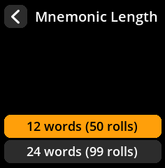
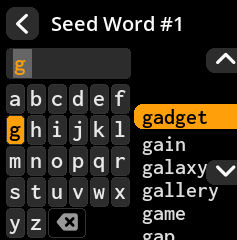

# SeedSigner User Guide

  

## Hardware Components

A SeedSigner device consists of:

1. Raspberry Pi Zero
2. Raspberry Pi Camera
3. WaveShare 1.3inch LCD Hat

## WaveShare LCD Hat Controls

  

The WaveShare LCD Hat has the following controls:

- **Joystick**: Used for navigating menus (Up, Down, Left, Right)
- **Key1 (A)**: Selection/confirm button
- **Key2 (B)**: Selection/confirm button
- **Key3 (C)**: Selection/confirm button

### Button Functions

| Button         | Function                                    |
| -------------- | ------------------------------------------- |
| Joystick Up    | Move selection up                           |
| Joystick Down  | Move selection down                         |
| Joystick Left  | Move selection left                         |
| Joystick Right | Move selection right                        |
| Key1 (A)       | Select highlighted option or confirm action |
| Key2 (B)       | Select highlighted option or confirm action |
| Key3 (C)       | Select highlighted option or confirm action |

**Important Note**: All three keys (Key1, Key2, Key3) function identically for selection and confirmation. To go back to a previous screen, you must first navigate to the back icon/button on the screen using the joystick, then press any of the three keys to activate it.

SeedSigner is an air-gapped, open-source Bitcoin signing device that helps you manage seed phrases and sign transactions securely. This guide provides step-by-step instructions organized by common workflows.

## 📋 Table of Contents

- [Getting Started](#-getting-started)
- [Creating New Seeds](#-creating-new-seeds)
- [Loading Existing Seeds](#-loading-existing-seeds)
- [Working with Loaded Seeds](#-working-with-loaded-seeds)
- [Signing Transactions](#-signing-transactions)
- [Verification and Security](#-verification-and-security)
- [Device Settings](#️-device-settings)
- [Troubleshooting](#-troubleshooting)

---

## 🚀 Getting Started

### Powering On and Navigation

#### Starting Your Device

1. **Connect Power**: Use the Micro USB cable to power your SeedSigner
2. **Wait for Boot**: Allow approximately 45 seconds for the splash screen to complete
3. **Dismiss Notification**: Press any key (A, B, or C) to dismiss the "You can remove the SD card now" message

     
   

> **💡 Pro Tip**: Once the OS loads into RAM, remove the SD card to ensure seed phrases cannot be accidentally stored on the device.

#### Powering Off

**Method 1: Power Menu**
1. Navigate to the **power icon** (top right of main menu)
2. Press any key to open power menu
3. Select **"Power Off"** and confirm

**Method 2: Safe Unplugging**
Simply unplug the device - SeedSigner stores nothing permanently, so all sensitive data is cleared when power is removed.

     
   

---

## 🌱 Creating New Seeds

### Camera-Based Seed Generation

Create truly random seeds using environmental entropy captured by the camera.

1. **Navigate**: Main Menu → **Seeds** → **"Load a Seed"** → **"Create a seed"**
2. **Select Method**: Choose **"New Seed (Camera Icon)"**
3. **Capture Entropy**: Point camera at a random scene and press any key
4. **Retake Option**: Move joystick left to retake, right to continue
5. **Choose Length**: Select **12 words** or **24 words**
6. **Acknowledge Warning**: Press "I Understand" after the "Classified Info" warning
7. **Record Words**: Write down all seed words (displayed 4 at a time)
8. **Verify Backup**: Complete the verification process to confirm accuracy

     
   

     
   

> **⚠️ Critical**: If you write down even one word incorrectly, you could lose access to your Bitcoin forever. Always verify your backup!

### Dice-Based Seed Generation

Generate seeds using physical dice for maximum security and true randomness.

1. **Navigate**: Main Menu → **Seeds** → **"Load a Seed"** → **"Create a seed"**
2. **Select Method**: Choose **"New Seed (Dice Icon)"**
3. **Choose Length**: 
   - **12 words** (requires 50 dice rolls)
   - **24 words** (requires 99 dice rolls)
4. **Roll Dice**: Roll physical die and select corresponding number on screen
5. **Complete Rolls**: Finish all required rolls
6. **Record Words**: Write down the generated seed words
7. **Verify Backup**: Complete verification process

     
   

     
   

> **🎲 Why Dice?** Physical dice provide true randomness that cannot be compromised by software vulnerabilities or hardware backdoors.

### Calculate Final Word (12th/24th Word)

Complete partial seeds when you have 11 or 23 words already.

#### Basic Process
1. **Navigate**: **Tools** → **"Calc 12th/24th word"**
2. **Choose Length**: Select **12 words** or **24 words**
3. **Enter Words**: Use on-screen keyboard with word suggestions:
   - **Key A**: Move up in suggestions
   - **Key C**: Move down in suggestions  
   - **Key B**: Select suggested word

     
   

#### Entropy Methods for Final Word

**🪙 Coin Flip Entropy**
- Flip a coin 7 times
- Select 1 (Heads) or 0 (Tails) for each flip
- View binary string and checksum calculation

     
   

**📝 Word Selection Entropy**
- Choose any word from the BIP39 wordlist
- System calculates using 11-bit binary + 4-bit checksum

**🔢 Finalize with Zeros**
- Uses 7-bit string of zeros + 4-bit checksum
- Automatic calculation

     
   

---

## 📥 Loading Existing Seeds

### Manual Seed Entry

Enter your existing mnemonic phrase using the on-screen keyboard.

1. **Navigate**: Main Menu → **Seeds** → **"Load a Seed"**
2. **Choose Length**: Select **"Enter 12-word seed"** or **"Enter 24-word seed"**
3. **Enter Words**: Use keyboard and word suggestions for faster entry
4. **Finalize**: Review seed fingerprint on "Finalize Seed" screen
5. **Complete**: Select **"Done"** or add **"BIP-39 Passphrase"** if needed

     
   

     
   

> **⚡ Speed Tip**: Use the word suggestions panel for much faster entry than typing each letter individually.

### SeedQR Scanning

Quickly load seeds from SeedQR codes.

1. **Navigate**: Main Menu → **Scan**
2. **Scan Code**: Point camera at your SeedQR
3. **Success**: Review on "Finalize Seed" screen
4. **Complete**: Select **"Done"** to load

     
   

> **❌ Error Handling**: "Unknown QR Type" means the QR code isn't recognized. Press "Done" and try again.

### Adding BIP-39 Passphrase (25th Word)

Enhance security with an optional passphrase.

1. **Access**: From "Finalize Seed" screen, select **"BIP-39 Passphrase"**
2. **Enter Passphrase**: Use on-screen keyboard with multiple character sets:
   - **Default**: Lowercase letters
   - **Key A**: Switch to uppercase
   - **Key B**: Numbers and symbols
   - **Key C**: Confirm passphrase
3. **Review**: Confirm or edit your passphrase
4. **Complete**: Select **"Done"**

     
   

> **🔐 Important**: A passphrase creates an entirely different wallet. Store it separately from your seed words.

---

## 🔧 Working with Loaded Seeds

### Export Public Key (Xpub)

Create watch-only wallets in your favorite Bitcoin software.

1. **Access**: From seed's main screen, select **"Export Xpub"**
2. **Signature Type**: Choose **"Single Sig"** or **"Multisig"**
3. **Script Type**: Select from:
   - **Native Segwit** (recommended)
   - **Nested Segwit**
   - **Taproot**
4. **Wallet Software**: Choose your wallet:
   - BlueWallet
   - Nunchuk
   - Sparrow
   - Specter Desktop
5. **Privacy Warning**: Acknowledge with "I Understand"
6. **Export**: Select **"Export XPub"** to display QR code
7. **Scan**: Import QR code into your wallet software

     
   

     
   

> **🔒 Privacy Note**: Your xpub reveals all your addresses. Only share with trusted wallet software.

### Generate Receiving Addresses

View and share your Bitcoin receiving addresses.

1. **Navigate**: Seed main screen → **"Address Explorer"**
2. **Script Type**: Choose **Native Segwit**, **Nested Segwit**, or **Taproot**
3. **View Addresses**: Select **"Receive addresses"** (displays 10 at a time)
4. **Share Address**: Select any address to display its QR code

     
   

     
   

### View Seed Words

Access your seed words for backup verification.

1. **Navigate**: Seed main screen → **"Backup Seed"** → **"View Seed Words"**
2. **Security Warning**: Press "I Understand" for classified info warning
3. **Review Words**: View all words (4 displayed at a time)
4. **Optional Verification**: Complete backup verification if prompted

     
   

> **🔐 Security Warning**: Only view seed words in a private, secure location away from cameras and prying eyes.

### Create SeedQR Backup

Generate QR code backups of your seed phrase.

1. **Navigate**: Seed main screen → **"Backup Seed"** → **"Export as SeedQR"**
2. **Format**: Choose **"Standard: 25X25"** or **"Compact: 21X21"**
3. **Warning**: Acknowledge that SeedQR contains your private key
4. **Review**: View complete QR code, then select **"Begin"** for zoomed sections
5. **Navigate**: Use joystick to review all QR code sections
6. **Complete**: Press any key when finished

     
   

     
   

> **⚠️ Important**: SeedQR codes are equivalent to your written seed backup. Store with equal security measures.

---

## ✍️ Signing Transactions

### Sign Bitcoin Transaction (PSBT)

Securely approve Bitcoin transactions from your wallet software.

1. **Access**: From seed's main screen, select **"Scan PSBT"**
2. **Scan Transaction**: Point camera at transaction QR code from wallet
3. **Review Details**: Carefully verify:
   - ✅ Recipient address
   - ✅ Amount being sent  
   - ✅ Transaction fee
4. **Select Seed**: Choose appropriate seed if prompted
5. **Sign**: Wait for "Signing Complete" message
6. **Broadcast**: Scan resulting QR code back into wallet software

     
   

     
   

     
   

> **🚨 Security Check**: Always verify recipient address and amount before signing. Bitcoin transactions cannot be reversed once broadcast!

---

## 🛡️ Verification and Security

### Verify Address Ownership

Confirm that an address was generated by your seed.

1. **Navigate**: Main Menu → **Tools** → **"Verify Address"**
2. **Scan Address**: Point camera at address QR code
3. **Select Seed**: Choose from loaded seeds or load new one
4. **Result**: Success message shows address belongs to your seed with index number

     
   

     
   

> **🔍 Why Verify?** Protects against address substitution attacks by confirming the address was actually generated by your seed.

### Discard Loaded Seed

Remove sensitive data from device memory.

1. **Access**: From seed's main screen, select **"Discard Seed"**
2. **Confirm**: Choose **"Discard"** to confirm removal
3. **Cleared**: Seed immediately removed from device memory

     
   

> **📝 Note**: Discarding only removes the seed from temporary device memory. Your written backup remains safe.

---

## ⚙️ Device Settings

### Language Configuration

1. **Navigate**: Main Menu → **Settings** → **Language**
2. **Select**: Choose your preferred language from available options

     
   

### Persistent Settings

Save your preferences to the SD card.

1. **Navigate**: Main Menu → **Settings** → **Persistent Settings**  
2. **Choose**: **"Enabled"** (saves to SD card) or **"Disabled"** (temporary)

     
   

### Coordinator Software Support

Enable/disable support for various wallet applications.

1. **Navigate**: Main Menu → **Settings** → **Coordinator Software**
2. **Configure Support** for:
   - ✅ BlueWallet
   - ✅ Nunchuk  
   - ✅ Sparrow
   - ✅ Specter Desktop
   - ✅ Keeper

     
   

### Advanced Settings

#### Bitcoin Network Selection
1. **Navigate**: Settings → **Advanced** → **Bitcoin Network**
2. **Options**:
   - **Mainnet** (default)
   - **Testnet** 
   - **Regtest**

     
   

#### QR Code Density
1. **Navigate**: Settings → **Advanced** → **QR Code Density**
2. **Options**:
   - **Low**
   - **Medium** (default)
   - **High**

     
   

#### Camera Rotation
1. **Navigate**: Settings → **Advanced** → **Camera Rotation**
2. **Options**:
   - 0 degrees
   - 90 degrees
   - **180 degrees** (default)
   - 270 degrees

     
   

#### BIP-39 Passphrase Configuration
1. **Navigate**: Settings → **Advanced** → **BIP-39 Passphrase**
2. **Options**:
   - **Enabled** (default) - passphrase optional
   - **Disabled** - no passphrase support
   - **Required** - mandatory passphrase for every seed

     
   

### Hardware I/O Testing

Verify all device components are functioning correctly.

1. **Navigate**: Main Menu → **Settings** → **I/O Test**
2. **Test Components**:
   - 🕹️ Joystick (all directions + center press)
   - 🔘 All three keys (A, B, C)  
   - 📷 Camera functionality

     
   

> **🔧 When to Use**: After device assembly or when troubleshooting hardware issues.

---

## 🔧 Troubleshooting

### Common Error Messages

| Error | Solution |
|-------|----------|
| **"Unknown QR Type"** | QR code not recognized. Ensure you're scanning valid SeedQR, PSBT, or address QR |
| **Camera Issues** | Check ribbon cable connection and clean camera lens. Test in I/O menu |
| **Navigation Problems** | Remember all three keys (A, B, C) work identically. Use joystick first |

     
   

### Common Solutions

#### 🤔 Forgot to Write Down Seed Words?
If the seed is still loaded: **Backup Seed** → **View Seed Words**

#### 🧊 Device Frozen?
Simply unplug and restart. No permanent damage possible since nothing stores permanently.

#### 🔍 Can't Find a Screen?
Use back arrow to navigate up menu hierarchy, then follow guide paths.

#### 🙃 Camera Upside Down?
**Settings** → **Advanced** → **Camera Rotation** → adjust to 180° or appropriate orientation.

#### 💾 Settings Not Saving?
Enable **Persistent Settings** and ensure SD card is inserted.

     
   

---

## 📚 Additional Resources

- 🌐 **Official Website**: [seedsigner.com](https://seedsigner.com)
- 📖 **Documentation**: [SeedSigner Docs](https://seedsigner.com/faqs/)
- 💻 **Source Code**: [GitHub Repository](https://github.com/SeedSigner/seedsigner)
- 📷 **Screenshots**: [Screenshot Repository](https://github.com/SeedSigner/seedsigner-screenshots)

## 🤝 Contributing

SeedSigner is open-source software. Contributions, bug reports, and feedback are welcome on our [GitHub repository](https://github.com/SeedSigner/seedsigner).

## ⚖️ License

This project is licensed under the MIT License. See the [LICENSE](https://github.com/SeedSigner/seedsigner) file for details.

---

**⚠️ Disclaimer**: This software is provided "as is" without warranty. Always verify your backups and test with small amounts first. The developers are not responsible for lost funds due to user error.